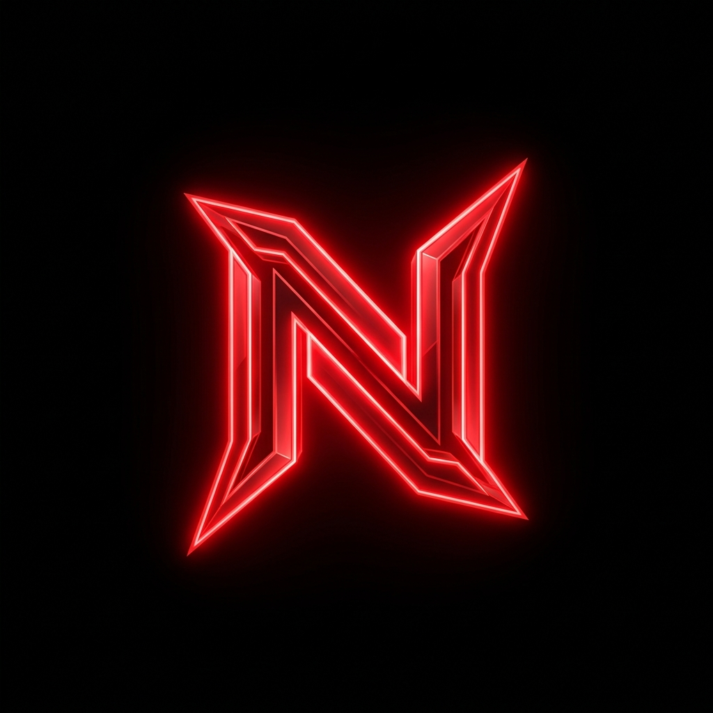

# NestCraft Network - Landing Page Premium & Modern

<p align="center">
  
</p>

<p align="center">
  <strong>Server Minecraft Indonesia Premium, Futuristik, & Modern</strong>
</p>

Landing Page premium, minimalis, futuristik, dan responsif untuk server Minecraft Indonesia, **NestCraft Network**. Desain web ini terinspirasi dari situs game modern dan esports profesional, menggunakan komposisi bersih, banyak *negative space*, tipografi yang tegas, serta animasi yang halus.

Web ini sepenuhnya kompatibel untuk dijalankan di lokal maupun dideploy langsung ke **Vercel**, **GitHub Pages**, **Cloud Run**, atau platform web modern lainnya.

---

## 🎨 Spesifikasi Visual & Palet Warna

- **Primary**: Merah (#D61F26)
- **Background**: Hitam (#0B0B0B)
- **Surface**: Abu-abu gelap (#1A1A1A)
- **Border**: Abu-abu (#2A2A2A)
- **Text**: Putih (#FFFFFF)
- **Secondary Text**: Abu terang (#B8B8B8)
- **Desain**: Efek *glassmorphism* tipis, bayangan lembut, sudut melengkung modern, visual grid fiksi-ilmiah, neon halus merah, dan pencahayaan sinematik premium.

---

## 🚀 Fitur Utama

- ⚡ **Desain Esports Futuristik**: Identitas visual orisinal yang jauh dari kesan medieval atau fantasi.
- 📱 **Fully Responsive**: Nyaman diakses dari perangkat mobile (smartphone), tablet, hingga monitor desktop ultra-lebar.
- 🔗 **Cross-Platform Connection Info**: Kartu informasi IP interaktif untuk Java & Bedrock Edition lengkap dengan status online server yang *real-time*.
- 📋 **Satu-Klik Salin IP**: Tombol interaktif untuk menyalin IP Java (`minenest.my.id`) dan IP Bedrock beserta Port (`25441`).
- 🎮 **Game Modes Showcase**: Grid kartu 6 mode permainan modern yang bersih: Survival, PvP, OneBlock, SkyBlock, Creative, dan Parkour.
- 💬 **Discord Community Hub**: Tombol Call-to-Action utama yang menghubungkan pemain langsung ke server Discord resmi.
- 🛠️ **Struktur Konfigurasi Terpisah**: Semua data dinamis (link, IP, list mode game, info developer) tersimpan rapi dalam satu file konfigurasi (`src/config/serverConfig.ts`) agar mudah dimodifikasi di kemudian hari.
- 📈 **Optimasi SEO Terintegrasi**: Menggunakan struktur tag elemen semantik HTML5, Meta Tag lengkap, Open Graph untuk sosial media, dan Rich Snippets Schema.org untuk meningkatkan indeks mesin pencari Google.

---

## 📂 Struktur Folder Proyek

```bash
├── public/                 # File aset statis publik
│   └── logo.png            # Logo utama NestCraft Network
├── src/
│   ├── components/         # Komponen UI modular
│   │   ├── Header.tsx      # Bilah navigasi & watermark kredit pengembang atas
│   │   ├── Hero.tsx        # Judul, logo menyala, deskripsi, & tombol utama
│   │   ├── GameModes.tsx   # Grid kartu mode permainan (Survival, PvP, dll)
│   │   ├── ServerInfo.tsx  # Alamat IP interaktif & panduan bergabung
│   │   ├── DiscordCTA.tsx  # Banner ajakan komunitas Discord
│   │   ├── Footer.tsx      # Info copyright, lisensi & kredit footer
│   │   └── Toast.tsx       # Animasi pop-up notifikasi salin IP
│   ├── config/
│   │   └── serverConfig.ts # File pusat konfigurasi server (Semua data dinamis disimpan di sini)
│   ├── App.tsx             # Entry point komponen aplikasi
│   ├── index.css           # Styling global & setup Tailwind CSS v4
│   └── main.tsx            # Bootstrap React
├── .env.example            # Contoh deklarasi variabel environment
├── index.html              # Template HTML utama dengan Meta Tag & SEO Schema
├── package.json            # Daftar dependensi & npm scripts
├── tsconfig.json           # Konfigurasi sistem TypeScript compiler
└── vite.config.ts          # Konfigurasi bundler Vite
```

---

## 🛠️ Panduan Pengembangan Lokal

### Prasyarat
Pastikan Anda sudah menginstal **Node.js** (versi 18 ke atas) dan **npm** di komputer Anda.

### 1. Klon Repositori
```bash
git clone https://github.com/username-anda/nestcraft-landingpage.git
cd nestcraft-landingpage
```

### 2. Instalasi Dependensi
```bash
npm install
```

### 3. Jalankan Mode Developer
Jalankan server lokal untuk melihat preview perubahan secara instan:
```bash
npm run dev
```
Aplikasi akan otomatis berjalan di alamat `http://localhost:3000` (atau port default yang disesuaikan).

### 4. Build untuk Produksi
Gunakan perintah ini untuk memaketkan seluruh kode menjadi aset produksi statis yang super ringan dan dioptimalkan di folder `/dist`:
```bash
npm run build
```

---

## ☁️ Panduan Deploy ke Vercel

Landing page ini berbasis **Vite + React (TypeScript)** dan sangat mudah di-deploy ke **Vercel** hanya dalam beberapa detik:

1. Push proyek ini ke repositori **GitHub** Anda.
2. Masuk ke dashboard [Vercel](https://vercel.com/) dan buat proyek baru dengan menghubungkan akun GitHub Anda.
3. Vercel akan mendeteksi framework **Vite** secara otomatis.
4. Gunakan pengaturan build default berikut:
   - **Framework Preset**: `Vite`
   - **Build Command**: `npm run build`
   - **Output Directory**: `dist`
5. Klik **Deploy** dan situs Anda siap diakses secara global!

---

## 🤝 Kontribusi & Kredit Pengembang

Web ini dirancang dan dikembangkan dengan penuh perhatian terhadap kenyamanan pengguna (*user experience*) oleh **RAN DEV**.

- **Pengembang**: RAN DEV
- **WhatsApp**: [0895602592430](https://wa.me/62895602592430)

Jika Anda ingin menyesuaikan IP server, link Discord, atau detail mode game, silakan ubah file `/src/config/serverConfig.ts`.

---

## 📄 Lisensi
Proyek ini dilisensikan di bawah **MIT License**. Lihat file [LICENSE](./LICENSE) untuk informasi lebih lanjut.
